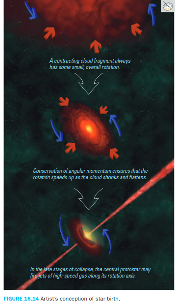

# ASTRO 122

## Chapter 15: Surveying the stars

### Objectives
>1. Properties of stars
>2. Patterns among stars
>3. Star clusters

### Properties of stars
* Stars form in great cloud of gas and dust, each one begins its life with roughly the same chemical composition as the sun
    * 75% hydrogen and 25% helium, no more than 2% of elements heavier than Helium
* Fundamental properties of stars: luminosity, surface temperature and mass
* How do we measure luminosity?
    * stars differ in brightness, but brightness depends on the distance of the star
    * **apparent brightness** = how bright stars look in our sky = amount of power reaching us (watts per unit square meter)
    * **luminosity** = total amount of power that a star emits into space (watts)
    * $$ apparent brightness = \frac{luminosity}{(4 \pi \times distance^2)} $$
    * we can measure a star's apparent brightness by using a detector that records how much energy strikes its light-sensitive surface each second. The only difficulties we face in measuring apparent brightness are making sure the detector is properly calibrated and, for ground-based telescopes, taking into account the absorption of light by Earth's atmosphere.
    * No detector can record light of all wavelengths.
    * total apparent brightness (luminosity) is the measurement across all wavelengths of the electromagnetic spectrum.

* Measuring distance through stellar parallax
    * stellar parallax = small annual shifts in a star's apparent position caused by Earth's motion around the sun.
    * parallax angle = the angle of the shift.
    * By definition, the distance to an object with a parallax angle of 1 arcsecond is 1 parsec.
    
        $$ d = 1/p $$ where d is the distance to an object in parsecs and p is the parallax angle in arcseconds
    
    * a star's absolute magnitude  is the apparent magnitude it would have if it were at a distance of 10 parsecs from Earth.

* How do we measure stellar temperatures?
    * usually mean surface temperature as opposed to interior temperature
    * stars come in different color because they emit thermal radiation at various measures
    * can be determined by looking at the colour and how bright the star is
    * using spectroscopy

* How do we measure stellar masses?
    * using Newton's version of Kepler's third law
    * can only be applied to binary star systems because the law requires an object to be orbitting around another

* Types of binary star systems
    * **visual binary** is a pair of stars that we can see distinctly as the stars orbit each other.
    * **spectroscopic binary** is identified through observations of Doppler shifts in its spectral lines. If one star is orbitting another, it periodically moves towards and away from us causing the shift.
    * **eclipsing binary** is a pair of stars that orbit in the plane of our line of sight. When neither star is eclipsed, we see the combined light of both stars. When one star eclipses the other, the apparent brightness of the system drops because some of the light is blocked from our view.

* Measuring masses and radii in binary systems
    * apply Newton's version of Kepler's third law

### Patterns among stars
* Since colors tell us about surface temperature, there must be a relationship between surface temperature and luminosity.
* Hertzsprung - Russell diagram
    * horizontal axis represents stellar surface temperature which corresponds to spectral type. Temperature decreases from left to right because Hertzsprung and Russell based their diagrams on the spectral sequence OBAFGKM
    * vertical axis represents stellar luminosity, in units of the Sun's luminosity (L_sun). Stellar luminosities span a wide range, so we keep the graph compact by making each tick mark represent a luminosity 10 times as large as that of the prior tick mark.
    * each location in the diagram represents a unique combination of spectral type and luminosity.
    * Stars in the upper left are hot and luminous, stars near the upper right are cool and luminous, stars near lower right are cool and dim, and stars near the lower left are hot and dim.
    * provides stellar information about stellar radii, because a star's luminosity depends on both its surface temperature and its surface area or radius. If two stars have the same surface temperature, one can be more luminous than the other only if it is larger in size.
    * Stellar radii must therefore increase as we go from high temperature, low-luminosity corner on the lower left of the HR diagram to the low temperature, high luminosity corner on the upper right.
    * most stars, like our Sun, fall somewhere along the **main sequence**, the prominent streak running from the upper left to the lower right on the HR diagram.
    * the stars in the upper right are called **supergiants** because they are very large in addition to being very bright.
    * just below the supergiants are the **giants**, which are somewhat smaller in radius and lower in luminosity
    * stars in the lower left are small in radius and appear white in color because of their high temperatures, these are called **white dwarfs**.
    * Stellar luminosity classes

        |   Class   |   Description     |
        |-----------|-------------------|
        |      I    |   Supergiants     |
        |      II   |   Bright giants   |
        |      III  |   Giants          |
        |      IV   |   Subgiants       |
        |      V    |   Main-sequence   |

    * classes II and IV are intermediate classes
    * mass is the most important attribute of a hydrogen-fusing star. The reason is that mass determines the balancing point at which the energy released by hydrogen fusion in the core equals the energy lost from the star's surface.
    * In general, a very luminous star must be very large or have a very high surface temperature, or some combination of both.
    * Since mass, surface temperature and luminosity are all related; we can estimate a main sequence star's mass just by knowing its spectral type.
    * Lifetimes along the main sequence
        * massive stars near the upper end of the main sequence have shorter lives than less massive stars near the lower end.
        * lifetime depends on mass and luminosity
        * mass determines how much hydrogen fuel the star initially contains in its core.
        * luminosity determines how rapidly the star uses up its fuel.
    * Giants and supergiants
        * upper right of the main sequence in an HR diagram
        * larger in radius than the sun
        * star's surface temperature determines the amount of life it emits
        * eventually runs out of fuel
    * White dwarfs
        * a giant with a mass similar to that of our sun ultimately ejects its outer layers, leaving behind a dead core in which all nuclear fusion has ceased.
    * **pulsating variable star** alternately expands and contracts, causing the star to rise and fall in luminosity.

### Star clusters
* all stars in a cluster lie at about the same distance from Earth
* all the stars in a cluster formed at about the same time 
* Two types:
    1. modest-size open clusters
    2. globular clusters
* the two types differ in how densely packed the cluster is and their location and age.

## Chapter 16: Star birth

### Objectives
>1. Stellar nurseries
>2. Stages of star birth
>3. Masses of newborn stars

### Stellar nurseries
* using the technique of main sequence turnoff point to determine the ages of star clusters, we have found that:
    * the youngest clusters are always associated with dark clouds of gas and dust, indicating that these **interstellar clouds** are the birthplaces of stars.
* where do stars come from?
    * average of two to three stars are born somewhere in the Milky Way galaxy each year
    * black patches within the Milky Way are **interstellar gas clouds** that appear dark because they block our view of the stars behind them. These gas clouds provide the raw material for star formation.
    * interstellar medium
        * gas and dust in spaces between stars
        * composed mostly of hydrogen and helium
        * use spectroscopy to measure the abundances of the new elements that stars have added to the interstellar medium
        * cloud absorbs some of the star's light, leaving the absorption lines in the star's spectrum
    * star-forming clouds
        * interstellar clouds are cold and dense to allow atoms to combine into molecules
        * temperature of a molecular cloud is between 10K and 30K, density around 300 molecules per cubic cm
    * interstellar dust
        * carbon, silicon, oxygen and iron found in tiny solid grains of dust
        * dust scatter or absorb virtually all the visible light that enters a molecular cloud, preventing us from seeing stars that lie behind it.
        * stars seen near the edges of a molecular cloud appear redder than similar stars outside the cloud, a phenomenon known as **interstellar reddening**
        * interstellar reddening occurs as follows:
            * dust grains block shorter wavelength photons of visible light more easily than longer wavelength photons.
            * near the edges of a moleular cloud, where stars are only partially obscured, the blocking of blue light causes stars to appear redder than their true colors
        * interstellar reddening is different from a Doppler shift because reddening does not change the wavelengths of a star's spectral lines.

* Why do stars form?
    * stars form when gravity causes a molecular cloud to contract and the contraction continues until the central object becomes hot enough to sustain nuclear fusion in its core
    * sun remains stable in size because the outward push of gas pressure balances the inward pull of gravity, this is called *gravitational equilibrium*
    * gas pressure is far weaker in the low density gas of interstellar space, but so is the pull of gravity
    * in most places within our galaxy, gravity is not strong enough to overcome the internal pressure of the interstellar gas, which is why star formation does not occur everywhere. Molecular clouds are the exception, they are the only places in which gravity can win the battle against pressure and start the formation of stars
    * **Fact**: Gravity can create stars only if it can overcome the outward push of the pressure within a gas cloud, which depends on both the density and the temperature of the cloud.
    * **Analogy**: consider gas particles inside a balloon. The outward pressure goes up if density of the gas particles in the balloon is increased because higher the density more collisions of gas particles inside the balloon. Temperature is also directly proportional to pressure.
    * Temperature-dependent pressure in ordinary gas clouds is called **thermal pressure**.
    * Preventing pressure buildup
        * regions of a molecular cloud in which the gravitational attraction is stronger than the thermal pressure are forced to contract.
    * Clustered star formation
        * most stars are born in large clusters because gravity is stronger in high mass gas cloud, making it easier for gravity to overcome the outward force due to thermal pressure.
        * magnetic fields can help the cloud resist gravity
        * starlight that has passed through a molecular cloud often has its electric and magnetic fields aligned in particular directions
    * Fragmentation of a molecular cloud
        * gravity helps accomplish this task
    * Isolated star formation
        * A molecular cloud that is highly dense and cold
    * First generation of stars
        * composition:
            * 70% hydrogen
            * 28% helium
            * 2% elements heavier than helium

### Stages of star birth

* What slows the contraction of a star-forming cloud?
    * A cloud fragment will continue to collapse on itself as long as it remains cold, and it can remain cold as long as photons emitted by molecules within the cloud can carry away the energy released by gravitational contraction
    * it's easy for photons emitted by molecules to escape from the cloud early in the process of contraction, while the cloud's density is still fairly low, because the photons are unlikely to run into any other molecules after they are emitted.
    * Trapping of thermal energy
        * cloud contraction makes it increasingly difficult for emitted photons to escape, because the growing density of the cloud increases the chances that a photon on its way out will be absorbed, leaving the absorbing molecule in an excited state.
        * collisions between particles increase thermal energy
        * For a while, dust grains can help keep the cloud cool by emitting infrared light, but as contraction packs the dust grains closer together, the infrared photons have trouble escaping the cloud.
        * The central region of the cloud fragment eventually grows dense enough **to trap almost all the radiation inside it**
        * The dense center of the cloud fragment is now a **protostar** (pre-main-sequence star).
        * protostars look starlike, with **surface temperatures and luminosities  similar to those of true stars**. But its core is not yet hot enough for nuclear fusion
    * Growth of a protostar by gas infall
        * A protostar's mass grows with time because a molecular cloud fragment contract in an inside out fashion
        * gravity is strongest where the gas density is the greatest
        * gas in the outer part of the cloud fragment feels a weaker gravitational pull, so it initially remains behind as the protostar forms
        * because the gas beneath has already contracted to make the protostar, the outer regions of the cloud fragment are with little pressure support from below
        * **this rain of mass onto the protostar continues until the gas surrounding the protostar is gone**, either because the gas runs out or because something blows the remaining gas away.
        * the star itself can blow the surrounding gases away through the combined effects of its radiation and stellar wind, much as the sun's radiation and solar wind are thought to have cleared out excess gas during the formation of our solar system
* What is the role of rotation in star birth?
    * protostellar disks
        * random motions of gas particles give a gas cloud some small overall rotation, although it may be imperceptibly slow.
        * However, the cloud's rotation must become much faster as the clouds shrink in size due to conservation of angular momentum
        * this prevents gas from raining directly down onto a protostar, causing it instead to settle into a **protostellar disk**.
        * gas in a protostellar disk can gradually spiral inward towards the protostar because of friction.
        * friction slowly causes the orbits of individual particles to shrink until the gas particles fall onto the surface of the protostar, thereby increasing the star's mass
        * The process in which material falls onto another body is called *accretion*. A disk in which friction causes material to spiral inward is often called an *accretion disk*.
        * protostellar disk is also important to slowing the rotation of the protostar itself. 
        * the protostar's rapid rotation generates a strong magnetic field. As the magnetic field lines sweep through the protostellar disk, they transfer angular momentum to outlying the material, slowing the protostar's rotation.
        * The strong magnetic field may also help to generate a strong **protostellar wind**.
    * protostellar jets
        * high speed streams of gas
    * single star or binary?
        * as a molecular cloud contracts, breaks up into fragments, and forms protostars, some of those protostars end up quite close to one another.
        * gravity can pull two neighbouring protostars closer together, but they usually don't crash into each other. Instead, they go into orbit around each other, because each pair of protostars has a certain amount of angular momentum.
        * pairs with large amounts of angular momentum have large orbits
* How does nuclear fusion begin in a newborn star?

TODO

# Chapter 17: Star stuff

## Lives in the balance
