# Lec 2: a modern view of the universe
* what is our place in the universe
    * Earth
    * solar system (x $10^6$)
    * milky way (x $10^8$)
    * local group (x 30)
    * local supercluster (x 30)
    * universe (?)
* 1 AU = 150M km
* 1 LY = 1e16m
* farther we look in distance, further back we look in time
# lec 3
* geocentric model: Earth in center
    * retrograde loop
    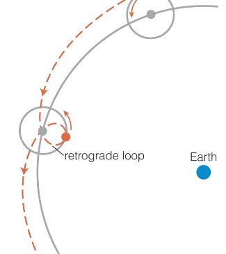
* Copernican revolution
    * heliocentric model: sun in the center
* Kepler's laws
    * orbits are elliptical
    * planets moves faster when they are closer to the sun, slower as they move farther away from the sun
    * more distant planets orbit the sun at slower average speeds, obeying the precise mathematical relationship
        $p^2 = a^3$
        where $p$ is the orbital period in years and $a$ is the orbital semimajor axis in AU

# lec 4
* Galileo
    * problems with the Copernican model
        * if Earth moved, objects such as birds would be left behind
        * non-circular orbits contradicted the concept of heavens being perfect and non-changing
        * nobody had detected stellar parallax
    * his solutions
        * there is a concept of inertia
        * second objected defeated by observing a supernova
        * used his telescope to defeat the third objection
* angular momentum = mrv
* change in angular momentum = torque = Fr

# lec 5
* conservation of momentum, angular momentum and energy
* conservation of angular momentum: if no external net torque acting on a system, then total angular momentum is conserved
* implications of Newton's gravity
    * planets are not the only objects with elliptical orbits
    * ellipses are not the only possible orbital shapes
    * objects orbit their common centre of mass
    * orbital characteristics tell us the masses of distant objects
# lec 6
* Newton's law of gravitation can be used to infer masses if the orbital properties are known:
    * $p^{2} = \frac{4 \pi^{2} a^{3}}{G (M_{1} + M_{2})}$
* tides are caused by a deformation of the Earth due to the difference in gravitational attraction from the moon
    * two tidal bulges: as Earth rotates, each point on the surface experiences the bulges twice a day.
    * water responds to the surface deformation, creating tides.
    * the sun also creates tidal deformations on Earth but the force due to the moon is stronger

# lec 9
* Stefan-Boltmann law: each square meter of a hotter object's surface emits more light at all wavelengths
    * radiative power per unit area = $\sigma \times T^4$
* Wien's law: hotter objects emit photons with higher average energy
    * wavelength of peak emission: $\lambda_{max} = 3mmK / T$

## The sun
* gravitational contraction
    * gravitational energy is converted into heat, which is then radiated away in photons
    * star shrinks with time
* how did fusion in the sun start?
    * sun formed out of a molecular cloud, that underwent gravitational contraction until the center was hot enough
* equilibria in the sun
    * gravitational equilibrium: gravity is balanced by pressure forces
        * also called hydrostatic equilibrium
        * inward push of gravity is balanced by the outward push of pressure forces, provided by the hot gas
        * more pressure closer to the core
        * higher pressure is associated to higher temperature to allow fusion to take place in the sun's core
    * energy balance: energy production by nuclear reactions is balanced by energy lost in radiation from the surface
        * energy generated per unit time by fusion in the core is equal to the energy per unit time leaving the surface in the form of photons
* solar structure
    * total radiative power is called luminosity
    * effective temperature: $L_{sun} = 4 \pi R_{sun}^{2}\sigma T_{eff}^{4}$
    * most of the emitted radiation is in the visible range, with secondary contributions from the infrared, UV and X-rays

        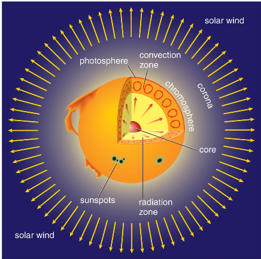

    * visible surface is called the **photosphere**
        * most of the light escapes from here
        * **sunspots** are visible on the sun's photosphere
    * **chromosphere**, outside of photosphere
        * hotter than photosphere
        * emits most of the UV light
    * **corona**, outside of photosphere
        * very low density but very hot layer that emits most of the sun's x-rays
    * **convection zone**
        * in which material transports energy by boiling
    * **radiation zone**
        * in which energy is transported by photon diffusion
    * **core** comprises the innermost and hottest region, in which energy is produced
* nuclear fusion in the sun
    * in the core of the sun, nuclear fusion reactions generate energy by converting hydrgon into helium
    * require high temperatures in the core of the sun
    * if two protons come close enough to each other, they can be stuck together by the strong nuclear force.
    * primary reaction: proton-proton chain
        * two protons fuse to make a deuterium nucleus (1p and 1n) and emitting a positron and a neutrino, occurs twice
        * deuterium + proton --> nucleus of Heium-3 + gamma ray, occurs twice
        * two Helium-3 fuse to form Helium-4, releasing two excess protons in the process
    * positron annihilates with an electron which results in energy
    * neutrino leave the sun
* sun's stability: solar thermostat
    * sun burns hydrogen at a steady rate due to a natural feedback cycle:
        * increase in core temperature ==> increase in energy generation ==> increase in pressure and core expands ==> decreasing temperature ==> decreasing energy generation

        * less energy generated ==> less pressure ==> core shrinks ==> increase in temperature ==> increase in energy generation
    * PV = kNT
        * N = number of particles
        * k = ideal gas constant
* sun's stability: core contraction
    * since the time of its formation, luminosity, radius and effectiive temperature have increased
* energy transport in the sun
    * radiative diffusion: photons bouncing around
        * photons collide with electrons
        * distance between collisions is called the mean free path
        * random walk
    * convection: circulation of matter
        * at constant pressure, hotter material has lower density
        * bouyancy lists hotter material because of lower density
    * rising hotter material occupies a larger volume. After giving up heat it shrinks and sinks
    * convection takes over from radiative diffusion because at lower temperature, gas absorbs photons more efficiently, mean free path shrinks, and diffusion is even slower. Convection goes all the way up to the photosphere.

* solar interior
    * can be studied in three different ways:
        * constructing mathematical models
            * describe equilibria
            * input param: mass, composition, knowledge of gas properties, nuclear reactions, photon opacities
        * solar vibrations
            * measure doppler shifts from different portions of the surface
            * helioseismology
        * solar neutrinos
            * neutrinos interact weakly with matter and thus probe the solar core directly

* solar activity
    * sunspots
        * appear darker because they are cooler
        * colder because magnetic fields suppress convection in their proximity, so hot material cannot come up to the surface easily
    * solar flares
        * short intense bursts of high energy radiation and charged particles due to magnetic field
    * solar wind
        * some regions of the corona lack hot gas: these are called coronal holes
    * effect on earth
        * flares and solar transient phenomena eject large number of particles which travel in huge bubbles called coronal mass ejections
        * once particles reach Earth, they create geomagnetic storm in the magnetic field that surrounds the Earth. Some effects:
            * generation of aurorae
            * disruptions of radio communications
            * additional drag to satellites on low Earth orbits
* Variations in solar activity
    * average number of sunspots on the sun gradually rises and falls
        * ave len of cycle is 11 years, can vary between 7 to 15 years
        * this is called the solar cycle

## Fundamental properties of stars
* three fundamental properties:
    * luminosity
    * surface temperature
    * mass
* parallax
    * displacement of difference in the apparent position of an object viewed along two different lines of sight, and is measured by the angle or semi-angle of inclination between those two lines
* stellar parallax is the effect of parallax on distant stars
    * due to shift in a star's apparent position due to the orbit of the earth around the sun
    * 1 parsec = 1 pc = 3.26 ly
    * 1 pc is the distance a star is away from us if its parallax angle is 1"
    * d = 1/p, where d is the distance to the star and p is the parallax angle in seconds
* luminosity
    * total amount of power emitted by a star
    * apparent brightness is the amount of power per unit surface area measured at a certain distance
    * total power passing through any sphere around the source is the same, regardless of distance and energy is spread evenly over surface area of sphere
        * $A = 4 \pi d^2$
        * $d$ is the distance to the source
    * $L = 4 \pi d^2 b$
        * $L$ is the luminosity of the star
        * $d$ is the distance to the star
        * $b$ is the energy per unit area per second
* surface temperature
    * use spectroscopy
    * spectral classes (hot to cool): OBAFGKM, each letter corresponds to different temperature ranges

* calculating radius from luminosity and temperature
    * $r = \sqrt{ \frac{L}{4 \pi \sigma T^{4}} }$

* binary star systems
    * visual binaries
        * directly observable stars orbiting around a common centre of mass
    * spectroscopic binary
        * periodic dopper shifts in their spectral lines
    * eclipsing binary
        * plane of the binary orbit is oriented edge-on to our line of sight, hence stars pass in front of each other
        * we detect them by periodic decreases in flux
* H-R Diagram
    * x-axis: decreasing temperature
    * y-axis: increasing luminosity
    * main sequence: stars powered by nuclear burning of hydrogen to helium
        * most are faint
        * sun is in the main sequence
    * giants and supergiants
        * upper-right corner
        * radius must be larger
    * white dwarfs
        * lower left
        * radius must be smaller
    * luminosity classes
        * supergiants
        * bright giants
        * giants
        * subgiants
        * main-sequence stars
    * star's mass determines the equilibrium point between gravity and pressure and thus the central temperature, nuclear burning rate and luminosity
    * stars with higher luminosity burn faster ==> they have shorter lifetime
* variable stars
    * some stars are not in exact gravitational equilibrium, but instead periodically expand and contract their outer layers, in a pulsating pattern
    * live in the instability strip on the HR diagram
* star clusters
    * group of stars forming gas clouds, they are useful because
        * stars in a given cluster are all at about the same distance from Earth
        * stars in a given cluster formed approximately at the same time
    * open clusters: found in the disk of the galaxy and are relatively young
    * globular clusters: found in the halo of the galaxy and are very old
* stellar nurseries
    * 2-3 stars are born in the milky way galaxy every year
    * youngest stars are associated with dark lumps of dust and gas, indicating that this is the place where stars form
    * lumps of gas in space are referred to as clouds
* interstellar medium
    * gas and dust fill in the space between stars
    * molecular clouds are cold and dense to allow star formation
    * dust in the ISM scatter most visible light that enters the molecular cloud, making them opaque
    * dust blocks bluer light more easily than red light
        * near the edges, stars behind it appear redder. This is called interstellar reddening
        * reddening can be distinguished from the doppler effect because reddening does not change the wavelength of spectral lines
## Formation of stars
* processes controlling star formation
    * gravity
        * depends on the density of a cloud and its size
        * gravity wins in molecular clouds because density is high and temperature is low

    * gravitational contraction in clouds
        * under the action of gravity, molecular clouds contract
        * gravitational energy is converted into thermal energy
        * clouds can remain cold throughout the process because photons can escape easily in the early stages of star formation
    * clustered star formation
        * different clumps can reach densities necessary to allow gravitational collapse, thus clouds can undergo fragmentation
    * first gen stars
        * did not have CO like stars today
        * much warmer than today's molecular clouds
        * in order to overcome high pressure, dense cloud fragments grow to a much larger size
        * first stars were likely much more massive on average
        * probably had shorter lifetimes
* stages of star formation
    * slowing of contraction and appearance of a protostar
        * increasing density during contraction makes it difficult for photons to escape because the mean free path between collisions become smaller
        * in the central regions of cloud fragments, gas becomes dense enough to trap nearly all radiation inside it
        * at this point, heat can no longer be efficiently radiated away and the central temperature and pressure increase quickly, pushing back against gravitational contraction
        * dense centre of the cloud fragment is now called a protostar
    * growth of protostars by gas infall
        * after a protostar forms, the rest of the molecular cloud fragment continues to collapse, raining down matter onto the protostar
        * matter infall continues until either the cloud gas runs out or until it is blown away
        * gas in the protostellar disk gradually spirals into the protostar due to friction
        * orbits of gas parcels in the disk gradually shrink until they fall to the surface: **accretion**
        * protostellar disk also helps slow down the protostar

    * role of rotation and protostellar disks
    * onset of nuclear fusion

# lec 16
* inital mass $\in [0.08M_{sun}, 150M_{sun}]$
    * lower limit is set by the amount of hydrogen available for nuclear fusion
    * upper limit is set by force of radiation pressure
* techniques to measure this distribution:
    * count stars with different masses in **young star clusters**
    * count stars with different masses in **the solar neighbourhood**
* lifecycle of stars and origin of elements
    * hydrogen, helium and very little traces of Lithium and Berrilium were made in the big bang
    * other elements are made in stars
    * life cycle of stars is shaped by a constant competition between **gravity** and **pressure** throughout the star's life
* stellar mass and lifetime
    * higher mass ==> shorter main sequence lifetime
    * larger weight of the different layers must be supported by 
    **higher central pressure**, this demands **higher central temperature**
    * **nuclear fusion** is extremely sensitive to **temperature**, so a moderate increase in the mass, results in a dramatic increase in the fusion rate and hence stellar luminosity
    * high mass stars are born with more hydrogen and they exhaust it at a very fast rate
* groups of stars based on mass:
    * low mass (mass less than $2M_{sun}$)
    * intermediate mass (mass between $2M_{sun}$ and $8M_{sun}$)
    * high mass (rest)
* low mass star evolution
    * after hydrogen burning reaches a self-sustaining rate, the star joins the main sequence
    * low mass stars have structure similar to the sun
        * energy is generated in the core and transported outward by radiative diffusion and convection
* low mass stars: main sequence
    * interiors differ primarily by the depth of their **convection zones**
    * cooler interiors
    * radiative diffusion is most efficient when the temperature is high and matter is fully ionized
    * deeper the convection zone, the more **stellar flares** are generated ==> bright X-ray outburts from low mass stars
* low mass stars: red giant phase
    * hydrogen is depleted, there is no more energy to balance gravity and the core starts to shrink
    * inert core is made of heium but its surroundings are made of hydrogen that has not yet been burned
    * this hydrogen eventually burns and the star is in the red giant phase
    * core contracts and luminosity continues to increase
    * after enough compression, helium core becomes dominated by degeneracy pressure. When this process stops, the stellar core becomes a helium white dwarf
* low mass stars: helium flash
    * triple alpha reaction: 3 He nuclei ---> 1 Carbon nucleus
    * core heats up and nuclear energy is generated, called helium flash
    * push back against gravity and expanding the core
* low mass stars: core helium burning
    * after the helium flash expands the core, helium burns in the core and hydrogen burns in a shell at a lower temperature than in the red giant phase, resulting in lower luminosity.
* low mass stars: double shell burning
    * helium and hydrogen shells burning at the same time
    * helium shell burning is not stable, and the star undergoes large spikes in nuclear burning called thermal pulses
* low mass stars: planetary nebulae
    * carbon core is left behind as white dwarf
    * high UV radiation

## lec 17
TODO

# lec 18: Special relativity 1
* special relativity deals with the nature of motion and light
    * no acceleration
* general relativity deals with the nature of gravity
* in relativity, space and time are part of a composite entity called **spacetime**.
    * observers moving at different speeds measure time differently
    * concept of simulateneous events is observer-dependent
    * this is necessary to understand effects when objects move at about the speed of light
* name comes from the idea that **motion is always relative**.
* example:
    * a plane travelling at exactly the Earth's rotations speed in the opposite direction will appear as stationary to a distant observer
* two absolutes:
    * laws of nature are the same for everyone
    * speed of light is the same for everyone (same value is measured by all observers)
* all predictions from the theory follow these two premises
* point of view for measuring motion is called a **reference frame**.
    * two observers are in the same reference if they do not move relative to each other
* Michelson-Moreley experiment showed that the speed of light is independent on the earth's velocity
* relative motion
    * to avoid gravity, consider spaceships in deep space (away from planets, stars and galaxies)
    * the spaceships float freely and everything is weightless.
    * Such a reference frame is a **free float frame** (or **inertial frame**).
* Time dilation
    * train moving at constant speed: bounce ball vertically inside the train
    * to observers outside the train, the ball acquires horizontal speed in addition to vertical speed: path is no longer vertical
    * the faster the train moves, the more slanted the path followed by the ball

    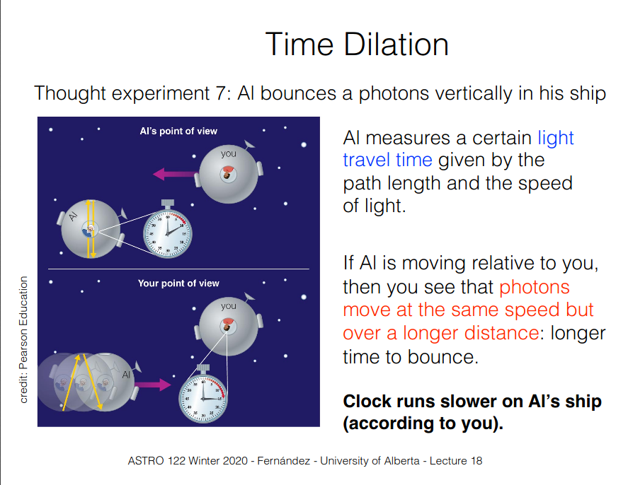

    * 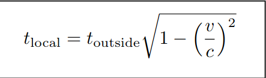
        * from your POV, them = local and you = outside
        * from their POV, you = local and them = outside

* Simultaneity
    * at low speeds, our common sense tell us that events that occur at the same time do so in an absolute sense, independent of their location.
    * order of simultaneity of events in different locations is frame-dependent
    * all frames agree about the order of events occuring at the same location in space
    * I do not understand this

* Length contraction
    * objects moving relative to you will appear shorter in the direction of motion than they would do if they were at rest
    * direct consequence of relativistic time dilation
    * 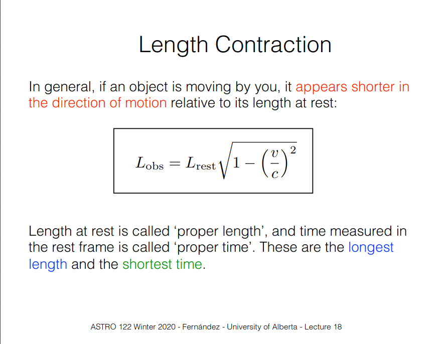

# lec 19: Special and general relativity
* Special relativity
    * mass increase
        * 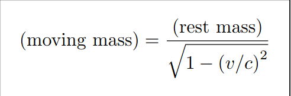
        * Where does $E = mc^2$ come from ?
            * Taylor expand the mass increase formula
        * $m_{moving} c^{2}$ is the total energy of an object, including rest mass and kinetic energy
        * Lorentz factor
            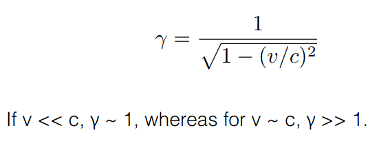

        * total energy = $\gamma m_{rest} c^{2}$
    * addition of velocities
        * nonlinear
        * always less than c
    * length contraction: interstellar travel
        * 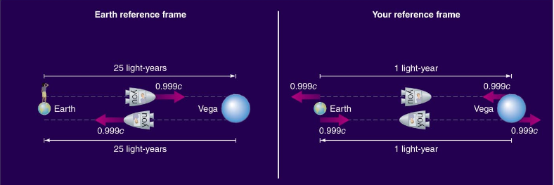

* General relativity
    * general relativity is about matter causing **spacetime to curve**, altering the motion of objects
    * higher mass ==> higher curvature
        * 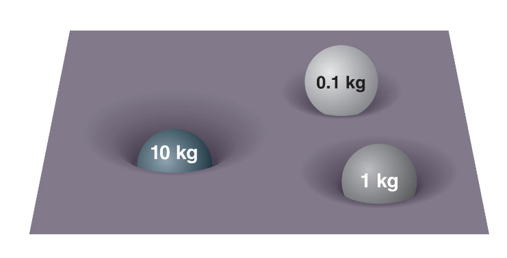
    * observed that introducing acceleration would break the relativity of motion
    * equivalence principle: effects of gravity are equivalent to the effects of acceleration
        * origin of general relativity
    * Einstein understood that matter in gravitational fields moves along the shortest possible path in a curved spacetime
        * this motion is not due to force, its due to the spacetime curvature

# lec 20: General relativity 2
* spacetime dimensions
    * 4 dimensions: x, y, z and time
    * time is different for different observers
    * space is different for different observers
    * spacetime is the same for everyone
    * can be measured using spacetime diagrams
        * 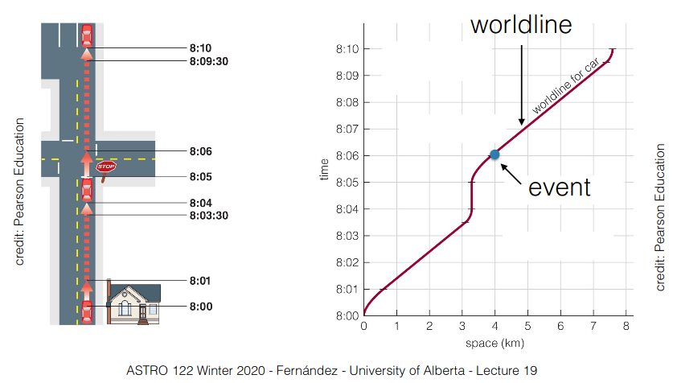
* curvature and geometry of spacetime
    * flat geometry (Euclidean)
        * sum of angles of a triangle is $\pi$
        * shortest path is straight line
        * parallel straight lines stay parallel
    * spherical geometry
        * sum of angles > $\pi$
        * shortest path is an arc of a great circle
        * parallel lines eventually converge
    * saddle-shaped geometry
        * sum of angles < $pi$
        * shortest path is a hyperbola
        * parallel lines eventually diverge
    * universe has no centre and no edges
    * if you feel weightless, it means you are travelling on a path of shortest possible distance in spacetime
        * in maths, this is called a geodesic
    * if you feel weight, then you are not on the shortest possible path
* Curvatures and black holes
    * Law 1: increasing the mass of a fixed size object: gravity increases at any given distance from the object
    * Law 2: decreasing the object's size at fixed mass: gravity does not increase far from the object, but the spacetime close to it becomes severely curved.
    * if we decrease the size of an object continuously, there will be a point at which the curvature is so great that light cannot escape: we obtain a black hole
    * the point of no return is called the **event horizon** of a black hole, and anything inside it cannot have any influence on our observable universe
    * at the event horizon, the classical escape speed is equal to the speed of light. This allows us to calculate the radius of the even horizon.
        * radius of the horizon is called the **Schwarzschild radius**, depends only on the mass of the black hole
        * 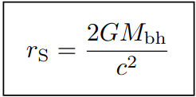
* curvature effects on time
    * 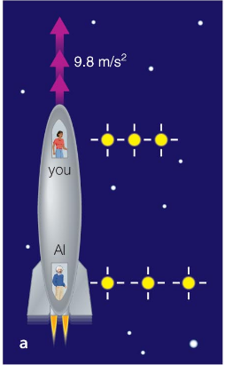
    * at constant speed, you are in the same reference frame and clocks run at the same rate.
    * if the ship accelerates, the reference frame is constantly changing.
        * if Al send periodic light flashes to you, you send periodic light flashes to you, you will measure them as less frequent than how they were emitted: you are moving awar relative to the frame in which pulses are emitted.
* **Go over various experiments in the slides**

* tests of general relativity
    * theory of general relativity makes a number of predictions, several of which have been successfully tested. Most important:
        1. precession of perihelion of Mercury
        2. gravitational lensing
        3. gravitational time dilation
        4. gravitational waves
* perihelion of Mercury
    * Newton's gravity predicts that Mercury's orbit should precess slowly around the sun due to the gravitational pull from other planets
    * However, observations showed that the actual precession is larger than predicted by Newton's theory.
    * General relativity correctly predicts the magnitude of the effect. It arises because of the curvature of space and gravitational time dilation.
* gravitational lensing
    * light follows the shortest possible path, so if space is curved then the path that light follows must also be curved. Effecrt first measured 1919 during solar eclipse
