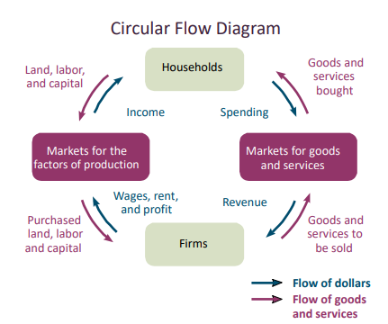

# Introduction to Macroeconomics

## Lecture 2

### Microeconomics review

- Scarcity and equilibrium are the fundamental problems of economics
- limited resources and unlimited wants
- market is always at equilibrium
- The Great depression in 1929, changed the way people see economy: people could not find jobs. Why not?
- John Maynard Keynes comes after the great depression and explains the great depression through his study of economics
- Performance of the economy when not in equilibrium
- Key term: interest

### Chapter 7 Measuring the wealth of nations
#### Objectives
>7.1 justify the importance of using market value of final goods and services to calculate GDP, and explain why each component of GDP is important.
>7.2 equivalence of expenditure approach and income approach to valuing an economy.
>7.3 explain the three approaches that are used to calculate GDP, and list the categories of spending that are included in the expenditure approach.
>7.4 explain the differences between real and nominal GDP, and calculate the GDP deflator.
>7.5 calculate and explain the meaning of GDP per capita and the real GDP annual growth rate.
>7.6 discuss some limitations to GDP, including its measurement of home production, the underground economy, environmental degradation, and well-being.

- Macroeconomics is about performance
  1. measurement: how to measure performance, quantitatively? ch7,8,10 are all about measurements (no perfect way to measure performance)
  2. policy: steps required to go from the current state to reach some goal, ch12,14 is about policy
  3. models: prove theoretically if the policy will work, before practically. (ch11)

* Macroeconomics is the study of the economy on a broad scale, focusing on issues such as economic growth, unemployment, and inflation.
  * working = producing a good or a service
  * we get income for working.
  * income value = value of the good/service produced
  * Define **GDP** as the sum of the market values of all final goods and services produced in a country within a given period of time.
  * Canada's GDP last year was $2M
  * World's largest economy: USA, USA's GDP is $20M
  * Conversion of foreign currency to USD (market value) affects GDP value.
  * G7 = group of 7 = world's largest economies
  * emerging economies = nations that are investing in more productive capacity
* Valuing an economy
  * Problems:
    1. How to add up unique goods and services into one measure of productivity?
    2. Not double counting intermediate goods and services that go into final goods and services
  * Refined definition: GDP is the sum of the market value ($) of all final goods and services produced within a country in a given period of time.
  * But some units are not constant over time. CAD$20 is not the same as CAD$20 after a year.
  * Only count the final good and services. Intermediate goods are produced goods used by someone else to produce another good or service. Final goods and services are nonintermediate goods and services.
  * produced within a country, company producing a good/service in Canada counts towards Canada's GDP.
  * Given period of time: usually annual
* Production = expenditure = income
  * size of economy is referred to as either output or production
  * input --> production --> output
  * 
  * Problems with the above diagram:
    * Government intervention? Taxes?
    * Financial market? Eventually we earn more than our expenditure
    * World economy? This diagram does not consider international trade

## Lecture 3
* Problems with measuring GDP
  - How to include expenditure on 'soft' things like Amazon purchases and netflix services?
* Three ways to measure GDP:
  1. Expenditure approach: break expenditures down into four categories:
    
    - consumption (~55%): spending on goods and services by private individuals and households.
    - investment (~25): spending on productive inputs, such as factories, machinery, and inventory changes.
      - investing in businesses helps them with increment of their revenue
      - investment creates jobs
      - investments are policy-sensitive: what if there is an excess of output?
      - oil and gas companies are biggest drops in investments because prices are fairly stable
      - Moreover, government intervenes with oil and gas trades
      - high risk! businesses might be forced to terminate that project you invested in
    - Government purchases (~14%): spending on goods and services by all levels of the government
      - includes heath services, education, national trade or any other services provided by the government
      - Federal and provincial governments are at the same level in Canada
      - Most taxes paid to the federal government, who provides the most services?
      - __Fiscal federalism__
      - Employment Insurance premiums go into general revenue
      - Breaking News: Justin Trudeau spent more than any other Canadian government ever!
    - Net exports (~1%)= exports - imports
      - A third of Canadian GDP comes from international trade, mainly USA
      - Canada imports more than exports
      - We buy oil at Western Canadian Select price
      - We follow WTO system when trading internationally
    - Expenditure = Consumption + investments + government spending + net export = production (Y = C + I + G + NX)

  2. Income approach: add up the income earned by everyone in a country.
    
    - includes wages earned by workers, interest earned on capital investments, rents earned on land, and profits earned by firms
    - I = wages + interest + rental income + profits

  3. Value-added approach: calculates the value that each transaction adds to the economy
    - each value added is the price of firm's output - cost of input
    - allows us to determine how much of the total amount paid was created at each step in the production process
    - helpful in avoiding double counting
    - calculates the resale of existing goods
  
* **Note:** Each approach gives us the same GDP value.

* Example:
  
  - Value added = price at output - price at immediate input

* Using GDP to compare economies
  * Dollar is not a good unit of measurement to compare economies.
  * Calculate the growth rate of GDP:
    - growth(x) = $\frac{x_t - x_{t-1}}{x_{t-1}} \times 100\% $
      where $x_{t-1}$ is the previous GDP and $x_t$ is the current GDP
    - rise in GDP is a function of output and prices
    - not reliable!
    