# Introduction to Macroeconomics

### Microeconomics review

- Scarcity and equilibrium are the fundamental problems of economics
- limited resources and unlimited wants
- market is always at equilibrium
- The Great depression in 1929, changed the way people see economy: people could not find jobs. Why not?
- John Maynard Keynes comes after the great depression and explains the great depression through his study of economics
- Performance of the economy when not in equilibrium
- Key term: interest

### Chapter 7 Measuring the wealth of nations
#### Objectives
>1. justify the importance of using market value of final goods and services to calculate GDP, and explain why each component of GDP is important.
>2. equivalence of expenditure approach and income approach to valuing an economy.
>3. explain the three approaches that are used to calculate GDP, and list the categories of spending that are included in the expenditure approach.
>4. explain the differences between real and nominal GDP, and calculate the GDP deflator.
>5. calculate and explain the meaning of GDP per capita and the real GDP annual growth rate.
>6. discuss some limitations to GDP, including its measurement of home production, the underground economy, environmental degradation, and well-being.

- Macroeconomics is about performance
  1. measurement: how to measure performance, quantitatively? ch7,8,10 are all about measurements (no perfect way to measure performance)
  2. policy: steps required to go from the current state to reach some goal, ch12,14 is about policy
  3. models: prove theoretically if the policy will work, before practically. (ch11)

* Macroeconomics is the study of the economy on a broad scale, focusing on issues such as economic growth, unemployment, and inflation.
  * working = producing a good or a service
  * we get income for working.
  * income value = value of the good/service produced
  * Define **GDP** as the sum of the market values of all final goods and services produced in a country within a given period of time.
  * Canada's GDP last year was CAD 2M
  * World's largest economy: USA, USA's GDP is CAD 20M
  * Conversion of foreign currency to USD (market value) affects GDP value.
  * G7 = group of 7 = world's largest economies
  * emerging economies = nations that are investing in more productive capacity
* Valuing an economy
  * Problems:
    1. How to add up unique goods and services into one measure of productivity?
    2. Not double counting intermediate goods and services that go into final goods and services
  * Refined definition: GDP is the sum of the market value (dollars) of all final goods and services produced within a country in a given period of time.
  * But some units are not constant over time. CAD 20 is not the same as CAD 20 after a year.
  * Only count the final good and services. Intermediate goods are produced goods used by someone else to produce another good or service. Final goods and services are nonintermediate goods and services.
  * produced within a country, company producing a good/service in Canada counts towards Canada's GDP.
  * Given period of time: usually annual
* Production = expenditure = income
  * size of economy is referred to as either output or production
  * input --> production --> output
  * 
  * Problems with the above diagram:
    * Government intervention? Taxes?
    * Financial market? Eventually we earn more than our expenditure
    * World economy? This diagram does not consider international trade

* Problems with measuring GDP
  - How to include expenditure on 'soft' things like Amazon purchases and netflix services?
* Three ways to measure GDP:
  1. Expenditure approach: break expenditures down into four categories:
    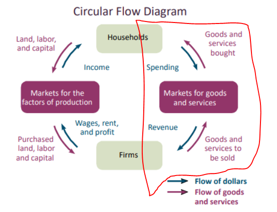
    - consumption (~55%): spending on goods and services by private individuals and households.
    - investment (~25): spending on productive inputs, such as factories, machinery, and inventory changes.
      - investing in businesses helps them with increment of their revenue
      - investment creates jobs
      - investments are policy-sensitive: what if there is an excess of output?
      - oil and gas companies are biggest drops in investments because prices are fairly stable
      - Moreover, government intervenes with oil and gas trades
      - high risk! businesses might be forced to terminate that project you invested in
    - Government purchases (~14%): spending on goods and services by all levels of the government
      - includes heath services, education, national trade or any other services provided by the government
      - Federal and provincial governments are at the same level in Canada
      - Most taxes paid to the federal government, who provides the most services?
      - __Fiscal federalism__
      - Employment Insurance premiums go into general revenue
      - Breaking News: Justin Trudeau spent more than any other Canadian government ever!
    - Net exports (~1%)= exports - imports
      - A third of Canadian GDP comes from international trade, mainly USA
      - Canada imports more than exports
      - We buy oil at Western Canadian Select price
      - We follow WTO system when trading internationally
    - Expenditure = Consumption + investments + government spending + net export = production (Y = C + I + G + NX)

  2. Income approach: add up the income earned by everyone in a country.
    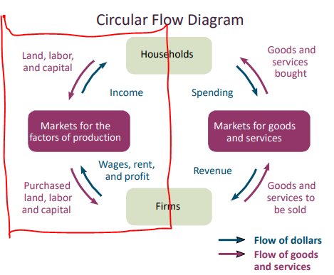
    - includes wages earned by workers, interest earned on capital investments, rents earned on land, and profits earned by firms
    - I = wages + interest + rental income + profits

  3. Value-added approach: calculates the value that each transaction adds to the economy
    - each value added is the price of firm's output - cost of input
    - allows us to determine how much of the total amount paid was created at each step in the production process
    - helpful in avoiding double counting
    - calculates the resale of existing goods
  
* **Note:** Each approach gives us the same GDP value.

* Example:
  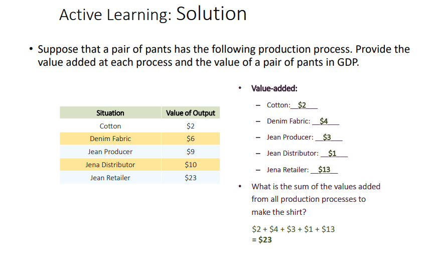
  - Value added = price at output - price at immediate input

* Using GDP to compare economies
  * Dollar is not a good unit of measurement to compare economies.
  * Calculate the growth rate of GDP:
    - growth(x) = $\frac{x_t - x_{t-1}} {x_{t-1}} \times 100\%$
      where $x_{t-1}$ is the previous GDP and $x_t$ is the current GDP
    - rise in GDP is a function of output and prices
    - not reliable!
* stocks and bonds are not investments because nothing is produced! Hence, not part of GDP.
* **Inflation** drives up GDP.
* **Real GDP**: Goods and services are values at constant prices.
  * To calculate:
    * Select a base year to fix prices.
    * Multiply the quantity of each good in a given year by its base year price.
  * can be interpreted as the amount of rise in production in the given amount of time.

* **Nominal GDP**: Goods and services are values at current prices.
  * Multiply the quantity of each good in a given year by its price in that year.

  * Example 1
    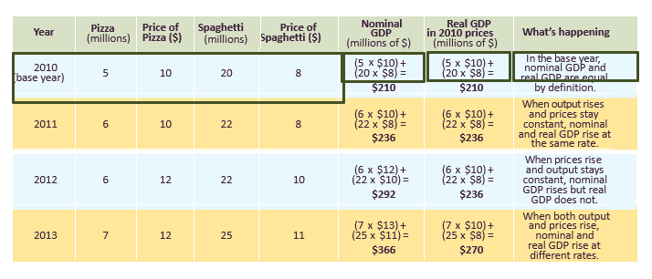

  * Example 2
    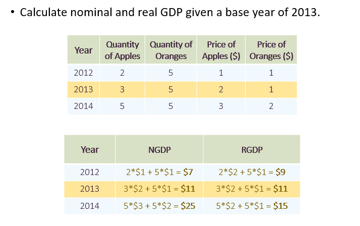

* Trivially, if base year == current year then real GDP = nominal GDP.
* If prices increases then nominal GDP increases ???

* **GDP deflator**
    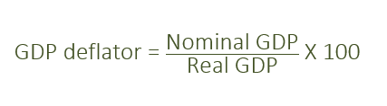
  * unitless, not a percentage either
  * provides the ratio between the base-year value of current output and the current-year value of current output
  * summarizes how prices have changes over a certain period.
  * inflation describes how fast the overall level of prices is changing.
  * inflation can be calculated by looking at the percentage change in the GDP deflator between any two years.
  * average is not a good indicator of the distribution of GDP, specially over a long period.
  * Example 1
    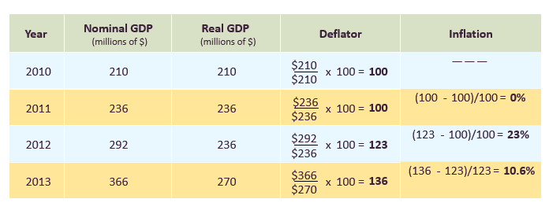
  * Example 2
    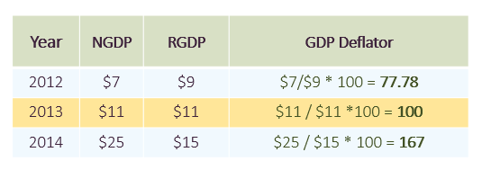
* Recall: GDP is used to compare economies to measure how we are doing compared to other countries
* Still a problem: GDP does not consider population!
* GDP per capita = GDP/population
  * suggests a lot about differences in life and well-being between countries.
  * does not provide information about the distribution of income or the cost of living within a country.
  * Even though GDP is low, cost of living might be low for a country and poor families can still afford to make their living.
  * Hence, GDP per capita does not tell anything about cost of living. Cost of living varies depending on the place you live in within a country.
  * income may not be high but growth may still be high
  * does not consider how far a dollar goes in each country.
* Growth rates can track business cycles:
  * _Recession_ is a period of significant economic decline - negative GDP growth rate.
  * _Depression_ is a particularly severe or extended recession.
  * Growth is more rapid in developing nations.
  * High growth rate does not necessarily associate with high total GDP or GDP per capita.
  * Growth rates are calculated based on real GDP.
* Limitations of GDP measures:
  * GDP calculations do not consider home production, the underground economy and environmental externalities.
  * Green GDP is an alternative measure of GDP that subtracts the environmental costs of production from the positive outputs normally counted.
  * Another measurement: human development index
    * considers income, health and education
    * observes life expectancy, literacy rate
    * not better indicator since high income countries can afford better health care and better education
    * low life expectancy have lower income
    * higher life expectancy implies higher education implies higher income
    * That is, factors are correlated.

* Chapter 7 Summary
  * GDP is the most commonly used tools in macroeconomics to measure the size fo an economy.
  * GDP is the sum of the market values of all final goods and services produced within a country in a given period of time.
  * Three approaches used to calculate GDP:
    * expenditure: classifies and adds up spending on all goods and services produced in an economy and subtracts spending on imports.
    * income: adds up income earned by everyone in a country.
    * value-added: accounts for the value that is added to the economy at each production stage.
  * GDP per capita allows comparisons over time and across countries.
  * However, it does not provide the full picture of an economy's health and quality of life.
  * Additionally, the overall price level can be calculated using nominal GDP and real GDP, called the GDP deflator.

* _Note: No formula sheet on exam!_
* _Note: Midterms contain 40 questions in an hour!_

### Chapter 8 Cost of living
* The cost of living
  * A large focus of macroeconomics is prices but more importantly how changes in prices impact our purchase power.
  * Prices change at different speeds across time and place.
  * Changing prices have effects on people's incentives and choices.
* market basket: a list of specific goods and services in fixed quantities
  * goal is to use this to see how the cost of buying these goods and services changes over time and location
  * items typically purchased by individuals
  * keeping the quantities of each item constant ensures that changes only reflect price changes
* Consumer price index
  * **price index** is a measure showing how much the cost of a market basket has changed relative to the cost in a base time period or location
    * base year is equalized to 100
  * **consumer price index** is a measure that tracks changes in the cost of a basket of goods and services purchased by a typical Canadian household
    * CPI = cost_of_desired_year_basket in base-year prices/cost of base-year basket_in_base-year prices x 100
* challenges in measuring price changes
  * which goods should be included in the basket
  * basket of goods remains fixed even if consumers substitute between similar goods
* price indices transform nominal values into real values
  * isolate changes in prices from changes in economic variables like input and output
* inflation rate
  * size of the change in the overall price level
  * it is calculated as the percentage change in the CPI from year to year
    inflation = (CPI_year2 - CPI_year1) / CPI_year1 x 100
  * ways to report inflation:
    * CPI:
      * headline inflation measures price changes for the entire market basket
    * PPI
      * measures the prices of goods and services purchased by firms
    * GDP deflator measures the prices of goods and services produced in the country
* deflating nominal variables
  * use CPI
  * real_value_year_Y = nominal_value_year_x x CPI_year_Y/CPI_year_X
* adjusting for inflation: indexing
  * wages should naturally rise to offset the effects of inflation
    * some prices however may change faster than wages
  * **indexing** is a practice of automatically increasing payments in proportion to the cost of living
* accounting for price differences across places
  * purchasing power parity (PPP) refers to the theory that purchasing power in different countries shoud be the same when stated in a common currency
  * PPP almost never holds because of:
    * transaction costs
    * non-tradables
    * trade restrictions
* purchasing power indexes
  * PPIs help describe differences in prices across locations
  * developing a PPI is similar to creating a price index:
    1. find a market basket of foods and services to compare across countries
    2. measure the price of the goods in each country
    3. calculate the cost of purchasing the basket in each country
    4. build an index showing how much the basket costs in each country relative to some base
* PPP-adjustment
  * recalculates economic statistics to account for differences in price levels across countries
  * PPP-adjusted GDP = nominal_dollars_country_A x [1 / (1 - price_level_adjustment(country_A))]
  * price level adjustment is the percentage difference in purchasing power between the two countries

### Chapter 9

#### Economic growth through the ages
* During the 1800s, the economic activity increased substantially
* During the 1900s, GDP grew faster than population, raising the standard of living for many
* real GDP per capita describes the change in purchasing power for each person over time
* given the growth rate in nominal GDP, real GDP per capita growth rate is calculated as:
  
  * real GDP per capita = nominal GDP - inflation - population
  * **Important:** all are rates here!

#### Compounding and the rule of 70
* economic growth builds on itself over time
  * this process is similar to compounding interest in a savings account
* a small annual growth rate can add up to a large change in an economy over time
* Canada average annual growth in real GDP per capita was 2% during the last century
* total change in GDP over time is bigger than the annual growth rate
* GDP per capita in any year: $GDP_A = GDP_B \times (1 + growth rate)^{(yr A - yr B)}$
* a simple shortcut to understand how many years it takes for GDP to double is the rule of 70:
  years until income doubles = 70 / (real GDP growth rate)

#### Determinants of productivity
* *Productivity* is a measure of the output per worker and is what drives growth.
* The only way to consume more and enjoy a higher standard of living is to increase the amount each person produces.
* The standard of living in a country is driven by the **average productivity of its workers**
  * increases in productivity per person --> increases in per capita income = economic growth

#### Components of productivity
* Physical capital is the stock of equipment and structures that allows for production of goods and services
* Human capital is the set of skills, knowledge, experience, and talent that determines the productivity of workers
  * missing risk taking
* Technological improvements are innovations that cause the same inputs to product more outputs
  * not only computers, also involves methods of producing goods and services
* Natural resources are production inputs that come from the earth

#### Convergence
* countries that start out poor will grow faster than rich ones and eventually converge to the same **growth rate** as the rich ones, but may never reach the same level in economy
* free trade allows Canada to work on something Canada is really good at, even though Canada does not hold resources locally
* Canada has good firefighters, medical equipments

#### Growth and public policy
* recent history has shown that a few decades of strong economic growth can transform lives through increases in standard of living
* public policy responses aim to spark and sustain growth
* there is no one-size-fits all policy: Canada's public policy may not work for some other country

#### Investments and savings
* **investment trade-off** is a reduction in current consumption to pay for investment in capital to pay for investment in capital intended to increase future production
  * developing nations tend to save more
  * developed nations tend to save less
  * *Foreign direct investment (FDI)* is when a firm runs part of its operation abroad or invests in another company abroad
    * Benefits
      * Government actively works to attract FDI when domestic savings are not large enough
      * Can result in human capital transfer from foreign firms to local workers
    * Costs
      * Firms might demand specific tax breaks or legal exemptions
      * Humans capital and technology transfer is not guaranteed
* **domestic savings** is savings for capital investments that come from within a country
  * two sources:
    1. households spending less than they earn
    2. government revenues exceeding non-capital expenditures
  * domestic savings = domestic income - consumption spending
  * $$ S = Y - (C + G) $$
  * savings for job layoff days, health emergency
    * Canada has CPP, health care plans ==> less saving can be done/needed
    * savings account interest is below inflation rate, better off saving money in stocks and bonds or homes
* The prices of many different goods and services must be considered when comparing the cost of living across time and place
* **market basket** is a list of specific goods and services in fixed quantities
* **price index** is a measure showing how much the cost of a market basket has changed relative to the cost in base time period of location
* **consumer price index** is a measure that tracks changes in the cost of a basket of goods and services purchased by a typical Canadian household.
  * 
* challenges in measuring price changes
  * which goods should be included in the market basket?
  * the basket of goods remains fixed even if the consumers substitute between similar goods. CPI keeps types and quantities of goods constant, which does not account for consumption changes
* Using price indices
  * similar to GDP, economic variables give an incomplete picture when expressed in nominal terms, as their real value may be different over time
  * price indices transform nominal values into real values
* Inflation rate
  * size of the change in the overall price level
  * $(CPI_1 - CPI_0) / CPI_0 \times 100$
  * several common ways to report inflation
  * CPI:
    * headline inflation measures price changes for the entire market basket
    * core inflation measures price changes with food and energy costs removed
      * energy and food prices fluctuate often, which could over or understate the real change in overall prices
  * Producer Price Index (PPI) measures the price of goods and services purchased by firms
  * GDP deflator measures the prices of goods and services produced in the country
  * CPI or PPI can be used to "deflate" nominal values into real values:
    real_Y = nominal_X x CPI_Y/CPI_X
  * **indexing** is a practice of automatically increasing payments in proportion to the cost of living.
  * **purchasing power parity** refers to the theory that purchasing power in different countries should be the same when state in common currency.
  * developing a ppi:
    1. find a market basket of foods and services to compare across countries
    2. measure the price of the goods in each country
    3. calculate the cost of purchasing the basket in each country
    4. build an index showing how much the basket costs in each country relative to some base
  * **PPP adjustment** involves recalculating economic statistics to account for differences in price levels across countries

    * $$ PPP_{adjusted GDP} = nominal_{dollars A} \times [ 1 / (1 - priceleveladjustment_A) ] $$

    * price level adjustment is the percentage difference in purchasing power between the two countries

* Education, health and technological developments
  * education: one of the most important ways that a country an increase its human capital is by ensuring that high-quality public education is freely available to all children
  * health: workers who are in good health will be more productive
  * technological improvements: helps countries improve the productivity of existing inputs
* Good government, property  rights and economic openness
  * enforcable laws and effective public services are critical
  * government stability
* The juggling act
  * trade-offs between different ways of promoting growth through public policy
    * many governments cannot pay for all of the factors that promote growth at once
    * the poorer the country, the harder the trade-off
    * this poverty trap is one of the main justifications for foreign aid that provides loans or funding for investment and development
    * there are trade-offs associated with economic growth and natural resource sacrifices

**--------------------------------------- cut-off for midterm -----------------------------------------------------------------------**

### Chapter 10 Unemployment and the demand for labor
* Defining and measuring unemployment
  * Statistics Canada defines unemployment as people who
    1. did not work at all in the previous week
    2. were available to work if they had been offered a job
    3. were making efforts to look for a job

* Measuring unemployment
  * the labour force refers to the people who are in the working-age population (aged 15 years or above) and are either employed or unemployed
  * the unemployment rate is the number of unemployed people divided by the number of people in the labour force:
    * unemployment rate = $\frac{unemployed}{labour force} \times 100%$
    * where labour force = number of employed and unemployed
  * labor-force participation rate (LFPR) determines the state of the economy is also understood by looking at the *labor-force participation rate*
    LFPR = (labor force / working-age-population) x 100%
  * LFP indicates what fraction of the population wants to be working, regardless of whether or not they actually have a job
    * it is common for the LFPR to fall during a recession
    
* Beyond the unemployment rate
  * limitations of unemployment rate:
    * discouraged workers: people who have looked for work in the past year because of labor market conditions
    * underemployed workers: people who are either working less than they would like or in jobs below their skill level

* Equilibium in the labor market
  * labor is bought and sold in a market, just like other goods and services
    * there is a demand for labor
    * there is a supply for labor
    * there is price
  * in most markets, the price is expected to adjust until the market reaches equilibrium, a point at which the quantity supplied equals the quantity demanded
  * existence of unemployment suggests that this simplest of models can't fully explain what goes on in the labor market

* categories of unemployment
* first, the *natural rate of unemployment* is the normal level of unemployment that persists in an economy in the long run
* three contributors to the natural rate of unemployment:
  1. frictional unemployment
    * caused by workers who are changing location, job, or career
    * natural and healthy part of life in a dynamic economy
  2. structural unemployment
    * caused by a mismatch between the skills workers can offer and the skills in demand
    * jobs might can move to a different country due to globalization
      * international trade is beneficial in macroeconomics but not necessarily in the labor market
    * how many people wear firefighter suits everyday, no point in producing more and more suits
  3. real-wage or classical unemployment results from wages being higher than the market-clearing level
* public policies and other influences on unemployment
  * unemployment is an impmortant indicator of the overall health of economy
* factors that may stop wage rates from falling
  * government might prevent falling wages throught minimum wage legislation
    * *minimum wage* is the lowest wage that a firm is legally allowed to pay its workers
  * *Labor unions* are groups of employees who bargain with their empoyer(s) over salaries and work conditions
  * *efficiency wages* are deliberately set above the market rate to increase productivity
* employment insurance
  * frictional and structural unemployment are part of the normal working of the economy
  * employment insurance is money paid by the government to people who are unemployed
  * effect of employment insurance is ambiguous because:
    * people might not look as hard for work if payment is generous
    * if people don't have to rush into taking the first job they are offered, they are more likely to find the right job for them

### Chapter 11 Aggregate demand and aggregate supply
* three features of the economy: output (GDP), prices and unemployment
  * do not fluctuate independently
* model of aggregate demand and aggregate supply shows how output, prices, and employment are all tied together as part of a single economic equilibrium
* when people buy an asset only because they believe the price will rise, it often creates an **asset-price bubble**.
* **aggregate demand** is equal to GDP
  * $AD = GDP = C + I + G + NX$
  * aggregate demand curve shows the relationship between the overall price level in the economy and output
    * decrease in price level ==> increases the amount of goods and services demanded
    * 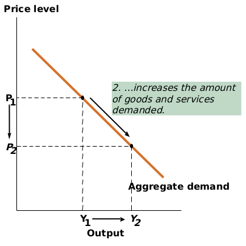
  * why does the AD curve slope downward?
    * Consumption (wealth effect)
      * prices rise ==> consumption fall, because their real wealth decreases
    * Investment
      * prices rise ==> interest rate rise ==> borrowing decreases ==> investment decreases
    * Net Exports
      * prices rise ==> goods become more expensive ==> imports increase and exports decrease
    * government spendings cause no effect
  * shifting the AD curve
    * when a nonprice factor increases (decreases) a component of AD, the entire AD curve shifts to the right (left)
    * 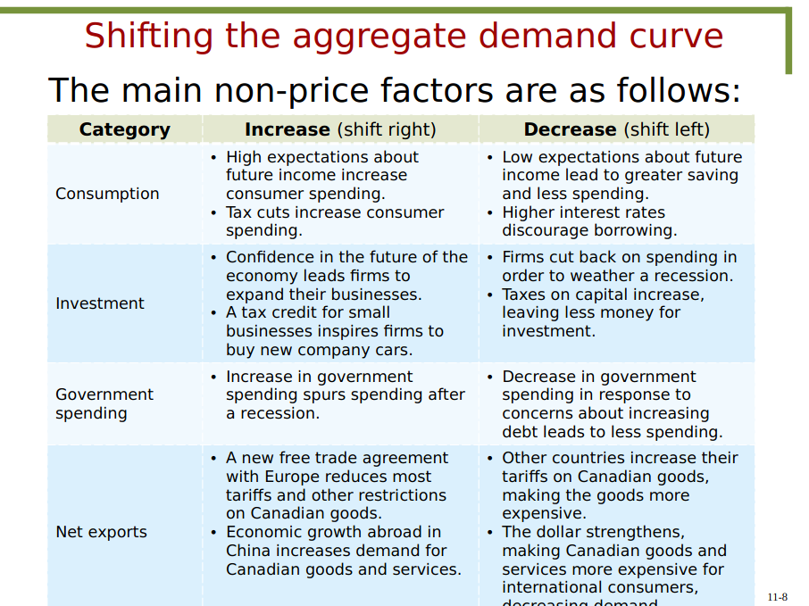
* **aggregate supply** is the sum total of the production of all the firms in the economy
  * shows relationship between the overall price level in the economy and total production by firms
  * represents production in the economy as a *whole*
  * can be expressed for long-run and short-run curves
  * short-run aggregate supply (SRAS)
  * 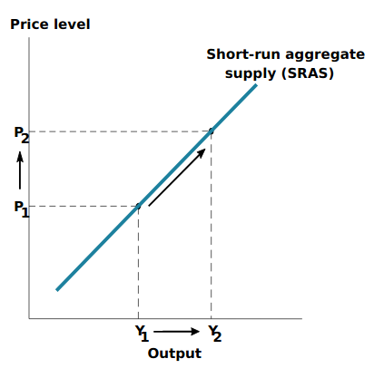
  * prices of final goods increase more quickly than input prices
  * long run aggregate supply
    * long-run refers to the time required for input prices to fully adjust to economic conditions
    * when input costs adjust, firms no longer earn positive economic conditions
    * economy returns to where it started
    * changes in the price level do not affect aggregate supply in the long run, in the long-run aggregate supply curve is fixed.
* business cycle
  * fluctuations of output around the level of potential output
  * output > potential output ==> economy is in a boom
* shifts in the SRAS curve
  * inputs become more expensive ==> decrease in short-run supply ==> left shift
  * supply shocks are significant events that directly affect production and the AS curve in the short-run
* in LRAS curve, production decisions are influenced by inputs, regardless of the overall price level
  * LRAS curve shifts outward if there is an increase in available inputs
  * everything that shifts LRAS also shifts SRAS
* economic fluctuations
  * equilbrium is at the point where AD = AS
* demand (supply) shock = sudden surprise event that temporarily increases or decreases demand (supply)
* role of public policy
  * it can take a long time for the economy to fully adjust to demand and supply shocks
  * waiting for adjustments is often difficult for producers and consumers
  * voters often call upon politicians to respond during a recession
  * government can try to boost the economy out of a recession through government spending
  * government can try to counter this negative demand shock by spending more to cause aggregate demand to increase
  * such policies are challenging to implement
    * difficult to gauge the overall effect of government spending on AD
    * rare to perfectly design policy to restore AD to its original level
    * government intervention impacts the long-run outcomes
* government spending summarized
  * not based on changed in the price level
  * long-run result of government intervention is higher prices but output may more quickly return to long-run levels
  * why would the government ever choose to intervene?
    * speed of recovery could be slow otherwise
    * lower prices are not always good for certain goods and services
  * government spending is a short-term policy action used to address short-term shocks

### Chapter 12 Fiscal policy
#### Fiscal policy
  * government policies: taxation or government spending
  * affects the economy by influencing AD
  * govt. spendings, tax policies directly affect consumption, which impacts AD
  * can be either _expansionary_ or _contractiionary_:
    * increasing gov spending and lower taxes have expansionary effects (Keynesian policy)
      * shifts AD to the right
    * decreasing gov spending and higher taxes have contractionary effects
      * shifts AD to the left
#### Policy response to economic fluctuations
  * AD/AS model illustrates how fiscal policy can counteract the effects of economic shocks
    * model predicts that the economy can correct itself automatically
    * lawmakers interven because automatic correction can be a painful and slow process
    * during a demand-side shock:
      * AD shifts to the left
      * lawmakers implement expansionary policies to shift AD almost back to the equilibrium point
    * positive economic shock: increase in economy rapidly
      * implement contractionary policies to shift AD almost back to equilibrium  
#### Time lags
  * time lags between when policies are chosen and when they are implemented often cause fiscal policy to be ineffective or even harmful:
    * information lag: understanding the current economy
    * formulation lag: deciding on and passing legislation
    * implementation lag: time to affect the economy
* **Policy tools: discretionary and automatic**
  * **Automatic stabilizers** are taxes and government spending that affect fiscal policy without specific action from policy-makers
    * Taxes work as automatic stabilizers because the income tax system is progressive
      * as earning rise, higher tax rates apply.
    * EI and welfare programs have eligibility criteria based on income or unemployment status
  * **Discretionary policy** may be used when automatic stabilizers are unsuccessful in correcting the economy
* **Limits of fiscal policy**
  * politicians often cut taxes in response to recessions
  * tax cuts aren't free because the government must find a way to make up for lost tax revenue
  * Ricardian equivalence predicts that if there are tax cuts but no decrease in spending, people will not change their behavior.
    * govt. will have to borrow money and at some point taxes will increase
* **Multiplier model**
  * multipler measures the effects of govt. spending or tax cuts on national income
  * **multiplier effect** is the increase in consumer spending that occurs when spending by one persono causes others to spend more too
    * this amplifies the impact of the initial govt. policy on the economy
  * To determine how much more GDP increases, the multiplier uses the proportion of income people spend.
  * Consumption is based on the amount of income left after paying taxes
  * The amount consumption increases when after-tax income increases by 1 dollar is called the **marginal propensity to consume (MPC)**.
    * between 0 and 1
    * equals the fraction of an additional dollar that is spent when an individual receives an additional dollar of income
  * **Government spending multiplier** is the amount that GDP increases when government spending increases by 1 dollar
    * government spending multiplier = $ \frac{ 1 }{ 1 - MPC } $
    * smaller MPC ==> smaller government spending multiplier
    * larger MPC ==> larger government spending multiplier
  * **taxation multiplier** is the amount that GDP decreases by when taxes increase by 1 dollar
    * taxation multiplier = $\frac{-MPC}{1 - MPC}$
    * multiplier effect of tax cuts is smaller than the effect of government spending
    * Tax cuts boost HDP indirectly through an effect on consumption
* **government budget**
  * by changing spending or taxes
  * may require the government to go into debt
  * contain tax revenues as their source of income and government purchases and transfer payments as expenditures
    * transfer payments are payments from the government to individuals for programs that don't involve a purchase of goods and services
  * **budget deficit** is the amount of money a government spends beyond its revenue
  * **budget surplus** is the amount of revenue a government brings in beyond what it spends
* **Government debt**
  * benefits
    * allows govt to be flexible when something unexpected happens
    * can pay for investments
  * costs
    * pay the amount + interest
    * indirect costs associated with govt debts distorting credit markets
